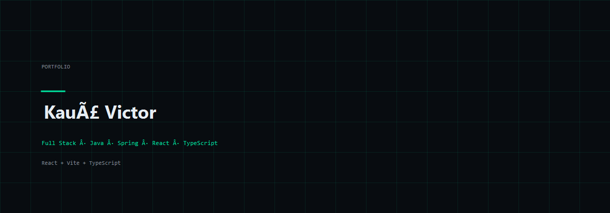

# Portfolio — Kauã Victor

<p align="center">
  
</p>

Personal site with an introduction, tech stack, GitHub projects, contact form, and a PDF resume link.

> **Why PNG?** GitHub often shows SVG images in the README as broken. This repo uses `docs/preview.png` so the banner displays reliably. Vector version: [`docs/readme-banner.svg`](docs/readme-banner.svg). Regenerate the PNG with `powershell -File scripts/gen-preview-png.ps1` after editing the script, or replace `docs/preview.png` with your own screenshot.

## Stack

| Area | Technologies |
|------|--------------|
| **Frontend** | React 19, TypeScript, Vite 8 |
| **Styling** | CSS (variables, responsive layout) |
| **Other** | Custom cursor, animations, `mailto` contact form |

## Run locally

```bash
npm install
npm run dev
```

Open the URL shown in the terminal (usually `http://localhost:5173`).

### Production build

```bash
npm run build
npm run preview
```

The `dist/` folder is ready to deploy (Vercel, Netlify, GitHub Pages, etc.).

## Project structure

```
src/
├── components/   # Hero, About, Stack, Projects, Contact, Navbar, Footer, Cursor
├── styles/       # global.css, responsive.css
└── App.tsx
docs/
├── preview.png          # README banner (PNG for GitHub)
└── readme-banner.svg    # same look, vector
public/
└── curriculo-kaua-victor.pdf   # resume (replace when you update it)
```

## Deploy

- [Vercel](https://vercel.com): import the GitHub repo; framework preset **Vite**.
- [Netlify](https://www.netlify.com): build `npm run build`, publish directory `dist`.
- [GitHub Pages](https://pages.github.com): set `base` in `vite.config` if the site lives under a subpath (`/repo-name/`).

## Author

**Kauã Victor** — Systems Analysis & Development, Senac University São Paulo.

- [GitHub](https://github.com/SonekaNatus)
- [LinkedIn](https://linkedin.com/in/kauã-victor-125a912aa)

---

### README image not showing on GitHub?

1. Commit and push **`docs/preview.png`** (`git add docs/preview.png && git commit -m "Add README preview" && git push`).
2. Use the **default branch** name in your remote (usually `main`).
3. Paths are **case-sensitive** on GitHub (`docs` not `Docs`).
